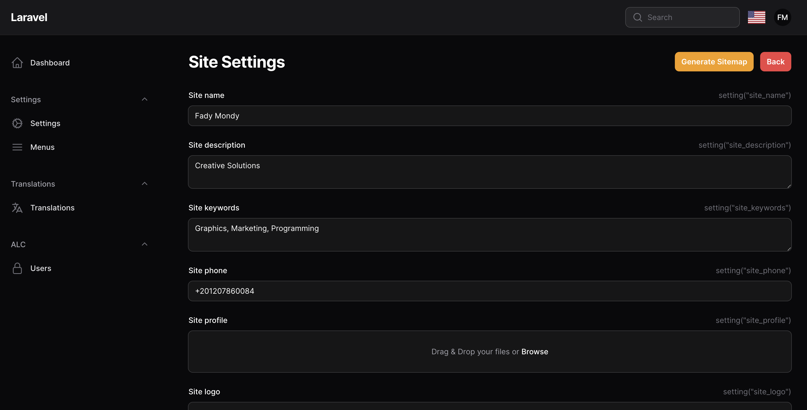

# Filament settings hub

Manage your app settings with GUI and helpers

## Screenshots





## Installation

```bash
composer require tomatophp/filament-settings-hub
```

now you need to publish and migrate settings table

```bash
php artisan vendor:publish --provider="Spatie\LaravelSettings\LaravelSettingsServiceProvider" --tag="migrations"
```

after publish and migrate settings table please run this command

```bash
php artisan filament-settings-hub:install
```

finally reigster the plugin on `/app/Providers/Filament/AdminPanelProvider.php`

```php
->plugin(\TomatoPHP\FilamentSettingsHub\FilamentSettingsHubPlugin::make())
```

## Usage

you can use this package by use this helper function

```php
settings($key);
```

to register new setting to the hub page you can use Facade class on your provider like this

```php
use TomatoPHP\FilamentSettingsHub\Facades\FilamentSettingsHub;
use TomatoPHP\FilamentSettingsHub\Services\Contracts\SettingHold;

FilamentSettingsHub::register([
    SettingHold::make()
        ->label(__('Site Settings'))
        ->icon('heroicon-o-globe-alt')
        ->route('filament.admin.pages.site-settings')
        ->description(__('Name, Logo, Site Profile'))
        ->group(__('General')),
]);

```

and now you can see your settings on the setting hub page.

we have a ready to use helper for currency settings

```php
dollar($amount)
```

it will return the money amount with the currency symbol


## Publish Assets

you can publish config file by use this command

```bash
php artisan vendor:publish --tag="filament-settings-hub-config"
```

you can publish views file by use this command

```bash
php artisan vendor:publish --tag="filament-settings-hub-views"
```

you can publish languages file by use this command

```bash
php artisan vendor:publish --tag="filament-settings-hub-lang"
```

you can publish migrations file by use this command

```bash
php artisan vendor:publish --tag="filament-settings-hub-migrations"
```

## Support

you can join our discord server to get support [TomatoPHP](https://discord.gg/Xqmt35Uh)

## Docs

you can check docs of this package on [Docs](https://docs.tomatophp.com/plugins/laravel-package-generator)

## Changelog

Please see [CHANGELOG](CHANGELOG.md) for more information on what has changed recently.

## Security

Please see [SECURITY](SECURITY.md) for more information about security.

## Credits

- [Tomatophp](mailto:info@3x1.io)

## License

The MIT License (MIT). Please see [License File](LICENSE.md) for more information.
